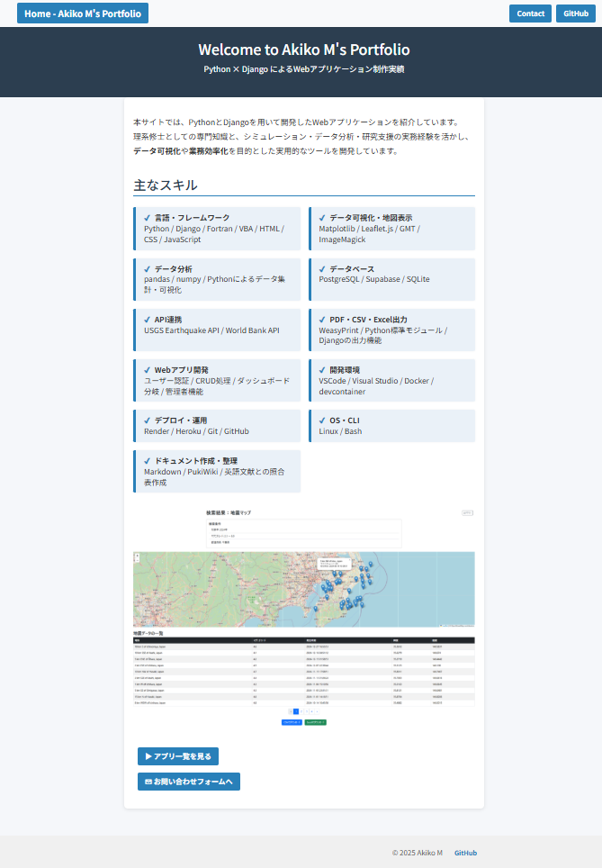
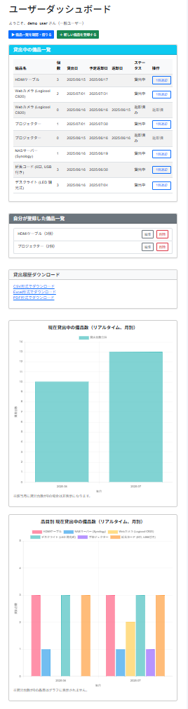
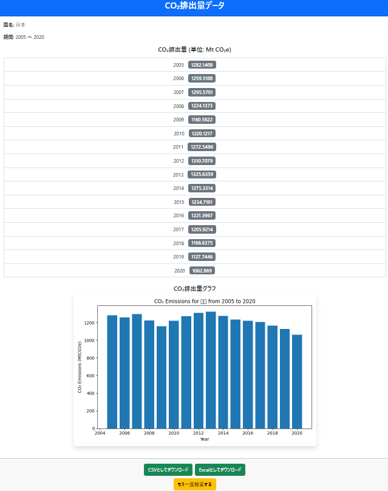

# ポートフォリオサイト（Django）

転職活動のために作成した**Django製**ポートフォリオサイトです。  
**3つのアプリ**をまとめて紹介しています。

  

## 掲載プロジェクト

### 1. **Inventory-app**
   - **備品管理**と**貸出申請**を行うアプリ
   - **ログイン機能**付き
   - 備品の**統計情報をグラフ**で表示
   - **CSV / Excel / PDF** 形式での出力

   - GitHub: https://github.com/TechCat-Hello/portfolio-site.git
   - デプロイ:https://portfolio-site-ebvx.onrender.com
 
   **デモログイン情報**
   - ユーザー名：`demo_user`
   - パスワード：`DemoPass2025`

   ※ デモ専用アカウントです。  
   データは予告なくリセットされる可能性があります。  

   

### 2. **地震可視化アプリ**
   - **USGS（米国地質調査所）API**を使って**地震データを可視化**
   - **都道府県・マグニチュード・年度で絞り込み**可能
   - **地図上に地震の発生地点をシンボル表示**し、**クリックすると地名と震度を表示**
   - **ログイン機能**付き
   - **CSV / Excel** 形式での出力  

   - GitHub: https://github.com/TechCat-Hello/quake_viz.git
   - デプロイ: https://quake-viz.onrender.com/login/ （ログイン必須）

**デモログイン情報**
   - ユーザー名：`demo_user`
   - パスワード：`Demo2025!`

   ※ デモ専用アカウントです。  
   データは予告なくリセットされる可能性があります。  

  

### 3. **CO2排出量可視化アプリ**
   - **World Bank（世界銀行）の公開データ**を使用して、**国別のCO2排出量を可視化**するアプリ
   - ユーザーが**国・開始年・終了年を指定**可能
   - **CSV / Excel** 形式での出力

   - GitHub: https://github.com/TechCat-Hello/co2_viz.git
   - デプロイ: https://co2-viz-b6d8014c247d.herokuapp.com　 （ログイン不要）

   

## 技術スタック

- **言語・フレームワーク**: Python 3.x / Django 4.x / Fortran / VBA / HTML / CSS / JavaScript
- **フロントエンド**: Bootstrap 5 / Leaflet.js
- **データ可視化・地図表示**: Matplotlib / GMT / ImageMagick
- **データ分析**: pandas / numpy / Pythonによるデータ集計・可視化
- **データベース**:
  - 開発環境: SQLite
  - 本番環境: PostgreSQL（Supabase）
- **API連携**: USGS Earthquake API / World Bank API
- **PDF・CSV・Excel出力**: WeasyPrint / Python標準モジュール / Djangoの出力機能
- **Webアプリ開発**: ユーザー認証 / CRUD処理 / ダッシュボード分岐 / 管理者機能
- **開発環境**: VSCode / Visual Studio / Docker / devcontainer
- **デプロイ**:
  - Heroku（CO2排出量可視化アプリ）
  - Render（Inventory-app, 地震可視化アプリ）
- **OS・CLI**: Linux / Bash
- **ドキュメント作成・整理**: Markdown / PukiWiki / 英語文献との照合表作成

## License
This project is licensed under the MIT License.  
See the [LICENSE](LICENSE) file for details.

## 📮 Author
TechCat  
GitHub: https://github.com/TechCat-Hello
